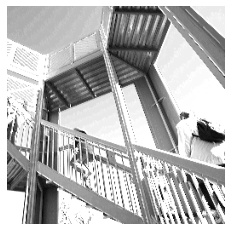

# Convolution and Pooling

## Convolution on misc.ascent()

filter_1 = [[-1, -2, -1], [0, 2, -1], [0, 0, 3]];  weight_1 =  1   

filter_2 = [[1, -2, -1], [0, 2, -1], [0, 0, 3]];   weight_2 = 1   

filter_3 = [[1, -2, -1], [0, 2, -1], [0, 0, 3]];   weight_3 = 3 

Output image:

                                 

## Pooling on misc.ascent()

**Pooling to the image after filter_2**

 
