# Convolution and Pooling

## Convolution on misc.ascent()

filter_1 = [[-1, -2, -1], [0, 2, -1], [0, 0, 3]];  weight_1 =  1   

filter_2 = [[1, -2, -1], [0, 2, -1], [0, 0, 3]];   weight_2 = 1   

filter_3 = [[1, -2, -1], [0, 2, -1], [0, 0, 3]];   weight_3 = 3 

Output image:

             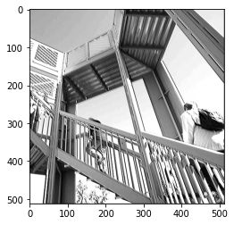               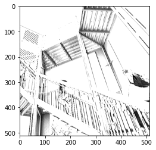     

## Pooling on misc.ascent()

Pooling to the image for the three previous images

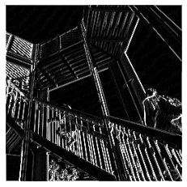            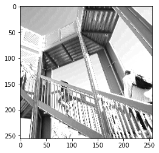              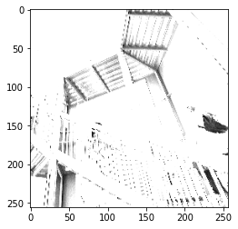 

## Convolution on self-chosen image

filter_1 = [[-1, -2, -1], [0, 2, -1], [0, 0, 3]];  weight_1 =  1   

filter_2 = [[1, -2, -1], [0, 2, -1], [0, 0, 3]];   weight_2 = 1   

filter_3 = [[1, -2, -1], [0, 2, -1], [0, 0, 3]];   weight_3 = 3 

Original image:

                 

Output image:

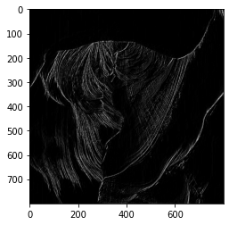             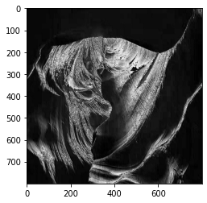               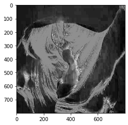     

## Pooling on misc.ascent()

Pooling to the image for the three previous images

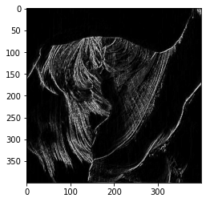            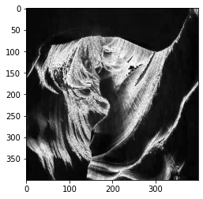              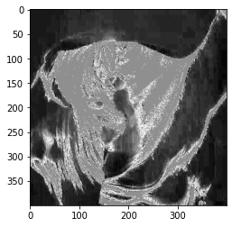 

## Comments on convolution and Pooling

   Convolution is a method where we use an m by m filter matrix to multiply a matrix generated by the pixels of a image. With this method, we could emphasize certain features of the image by adjusting the filter and the weight. 
  
   In my example, I selected three different combinations of filters and weights: 1) a uppertriangular matrix with negative determinant and weight 1; 2) a uppertriangular matrix with positive determinant and weight 1; 3) a uppertriangular matrix with positive determinant and weight 3. We can clearly notice that when a negative determinant enhances the dark part of the image, while a positive determinant enhances the bright part of the image. An increase in weight results in amplifing the effects of the filter; for example, in the third case, it makes the bright part looks more widespread. 
   
   Pooling is a sequential step after convolution that further highlights the features of the image. It reduces the length of the x-axis and y-axis by half, which results in quartering the size of the image. Nevertheless, as the example shows, the features of the image remain, and compared to the pre-pooling image, the one after pooling resembles an oil painting more than a photo. The reason is partially because for each 2-by-2 submatrix, the pooling method uses the maximum value to represent the whole matrix. That ends up reducing most of the 'decorative' information yet maintaining the features of the image in general.

## Convolved matrix
Using the filter to convolve the given 9-by-9 matrix

Original matrix and the filter: 

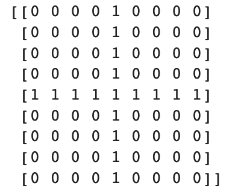            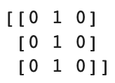 

Convolved matrix:

  
