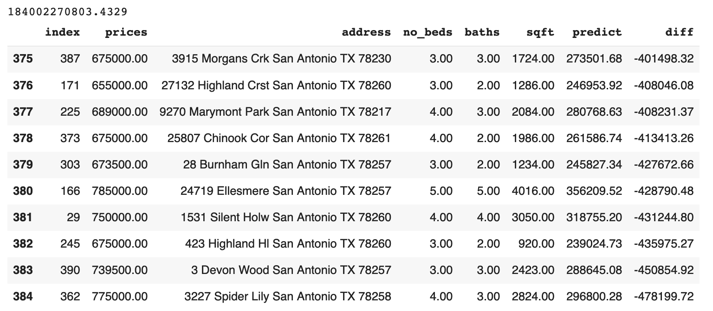
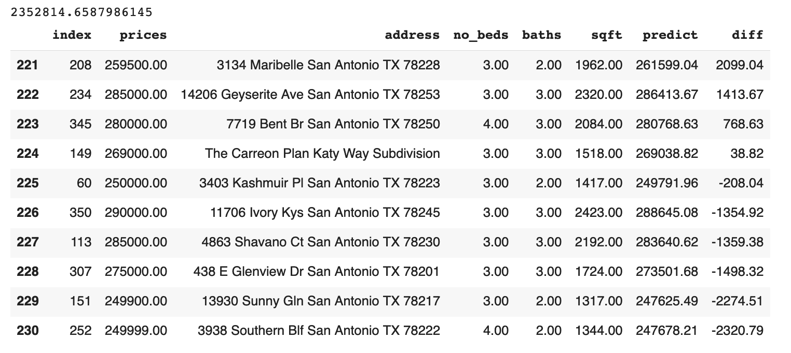

# Calculating the Mean Square Error on the housing data retrieved from Zillow

**City Selected: San Antonio, TX**

## 10 most over-predicted, most under-predicted and most accurate results.

Over-predictions: 

The MSE is approximately 9.387 * 10^7

Under-predictions:

The MSE is approximately 6.741 * 10^10

Accurate:

The MSE is approximately 5.949 * 10^10

## Analysis

The 389 data points are sorted in an ascending order by the difference between the predicted values and actual values, where negative number means under-prediction and positive number means over-prediction. Therefore, according to the model the data ranked at 1st is the most under-valued house, where the data ranked 389-th is the most over-valued house. The ten most accurate predictions resided at rank 123-132, which is the first one-third percentile. This demonstrates that the model trend towards over-predicting the home values.  
