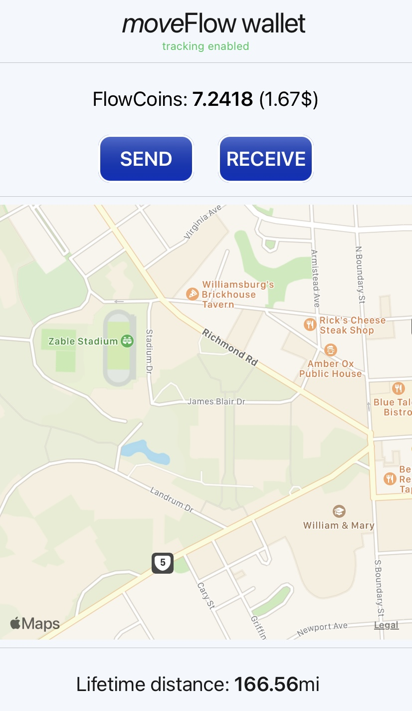
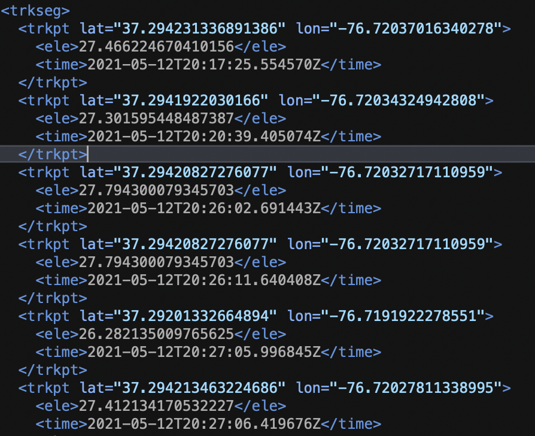
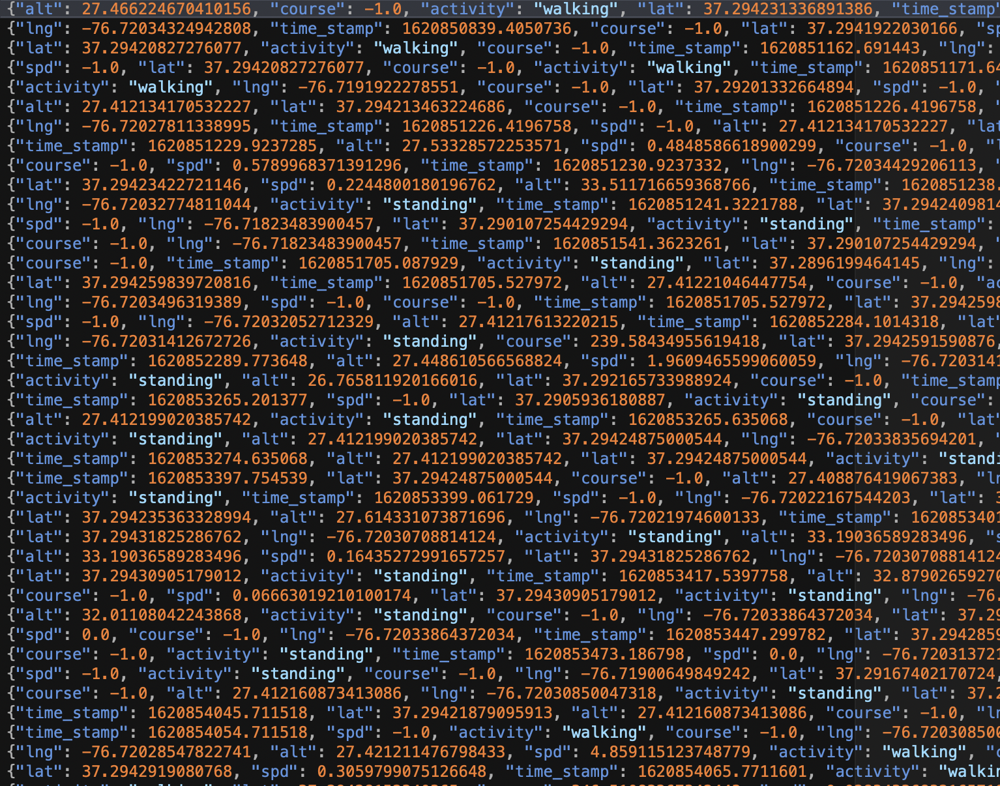
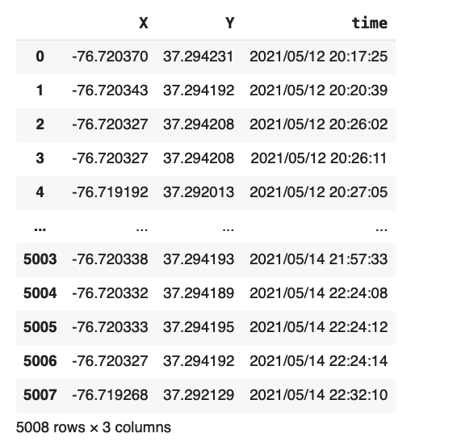
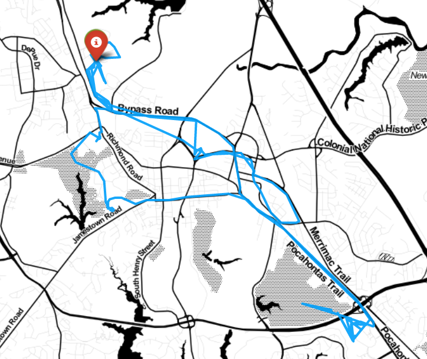
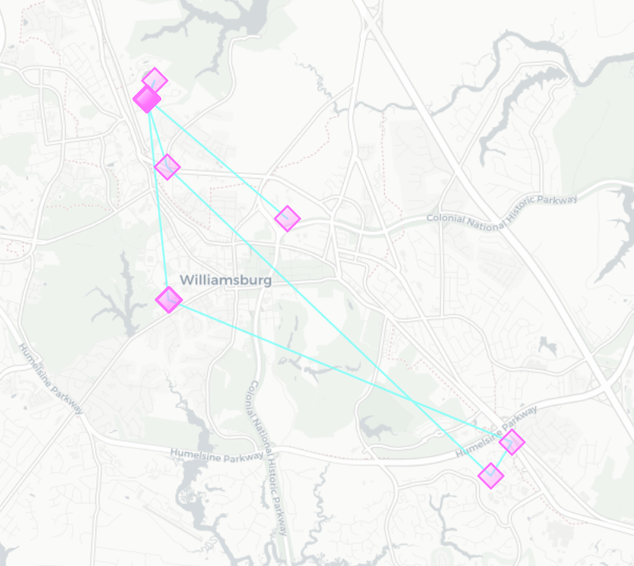
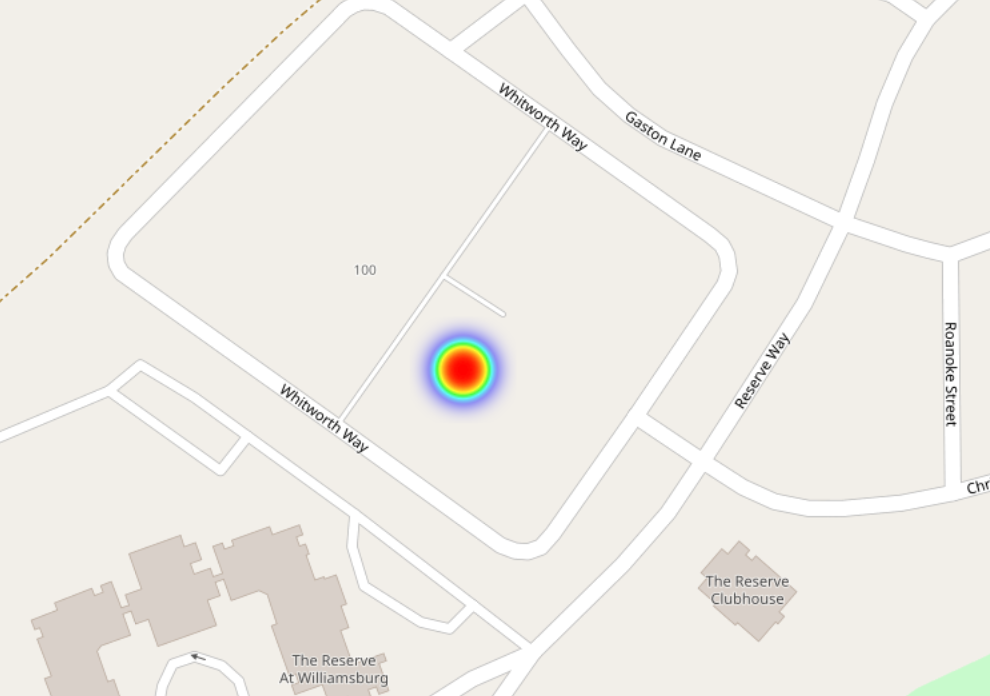
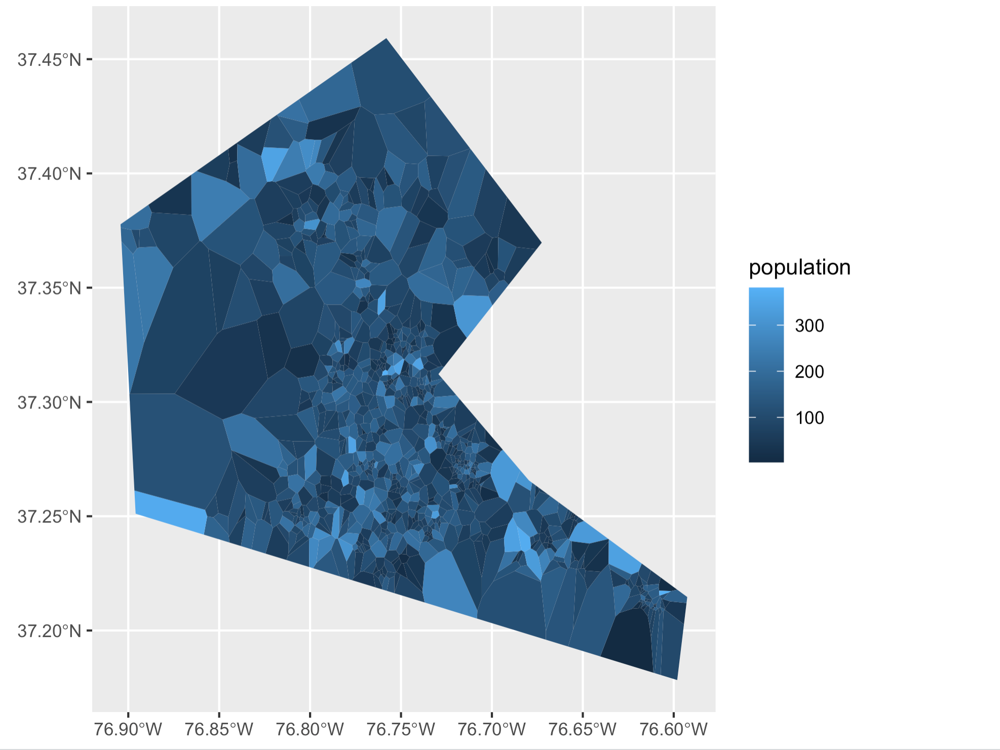
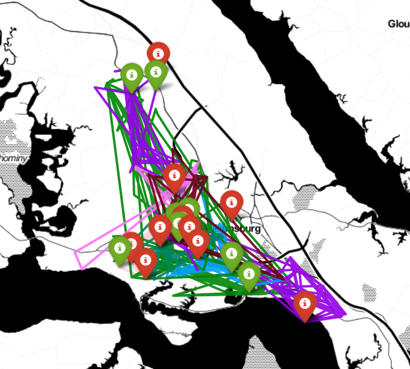

# Data 310 Final Project: Trajectory Prediction Based on GPS Data 

<br>
<br>

## Problem Statement

<br>

**Initiative**
- GPS  data is critical in analyzing movements of individuals or groups of people in a certain area
- The prevalence of cellphone makes it easier to collect personal GPS data (many apps ask for access to your location when you’re using it)
- Decide to make use of the GPS data for predictions
- Due to the privacy concerns, I would start with my personal GPS data

<br>

**Goal**
- Based my historical GPS data with time (longitude, latitude, and time when I’m at the location), build a machine learning model that will predict my future movements (trajectories).
- Assess how the model can be improved in order to apply to a dataset with a large number of agents. 

<br>

**Significance**
- At individual level, getting people’s trajectory enables us to create personalized recommendations for that individual. 
  - if we predict that a person will travel from suburban area to city center,  then we can advertise apartments for lease. 
- At group level, the ability to predict people’s future trajectory is even more significant.
  - Urban planning: building a new shopping mall based on where people frequently go
  - Public health: predict the spread of a disease

<br>

**Central Question:
How to predict my future movement trajectory based on my movement records?**

<br>
<br>


## Data Description

<br>

**Data Source**
- The Moveflow App developed by Mr. Gregor Laemmel and Dr. Tyler Frazier. 
- Collect the user’s location data while giving user flowcoins (a cryptocurrency) back as reimbursement
- Receive the data compiled by Mr. Gregor in two files, one gpx file, one jsonl file. 



<br>

**GPX file:** contains 4 columns: longitude, latitude, altitude and time stamp. 



<br>

**Jsonl file:** contains 3 more columns: speed, activity and course.



<br>

Although the jsonl file contains information that might be useful in the future (activity), I decide to use the gpx file since it’s time format is more readable and can be fit into the model.

<br>

Eventually,  I retrieve a pandas dataframe from the gpx file, the size of which is 5008 rows by 3 columns. The three columns are: X for longitude, Y for latitude, and time. 



<br>
<br>


## Model and Results

<br>


**Model Description**
We use the scikit-mobility package in Python. This package is able to 
- Process mobility data of various forms, including GPS data
- Extract mobility metrics and patterns from data
- Generate synthetic individual trajectories and move flows

The majority of the codes used to generate the model come from the scikit-mobility github repository. 

<br>


**Trajectory Data Frame**

``` Python
import skmob

# Create a TrajDataFrame
tdf = skmob.TrajDataFrame(track_points)
tdf.columns = ['lng','lat','datetime']
tdf['uid'] = 1
tdf

tdf.plot_trajectory(zoom=12, weight=3, opacity=0.9, tiles='Stamen Toner')
```



<br>


**Estimating Stops**

```Python
from skmob.preprocessing import filtering
ftdf = filtering.filter(tdf, max_speed_kmh=500.)
n_deleted_points = len(tdf) - len(ftdf)

from skmob.preprocessing import detection
stdf = detection.stops(tdf, stop_radius_factor=0.5, minutes_for_a_stop=20.0, spatial_radius_km=0.2, leaving_time=True)

m = stdf.plot_trajectory(max_users=1, start_end_markers=False)
stdf.plot_stops(max_users=1, map_f=m)
```



<br>


**Estimating Home**

```Python
from skmob.measures.individual import jump_lengths, radius_of_gyration, home_location
rg_df = radius_of_gyration(tdf)
jl_df = jump_lengths(tdf.sort_values(by='datetime'))
hl_df = home_location(tdf)

import folium
from folium.plugins import HeatMap
m = folium.Map(tiles = 'openstreetmap', zoom_start=12, control_scale=True)
HeatMap(hl_df[['lat', 'lng']].values).add_to(m)
```



<br>


Individual Generative Model

We have the basic models that predicts the stops and home location based on my historical GPS data.  The next step is to generate agents based on the data and predict their trajectories in a certain time interval. To Achieve that ,we first need a tessellation -- an object that marks the subdivisions of a certain area, and in my case, James City County. 

With the help of Dr. Frazier, I retrieve the shapefiles for James City.



<br>

```Python
from skmob.models.epr import DensityEPR
tessellation = gpd.read_file('jamescity.shp')
start_time = pd.to_datetime('2021/05/19 09:00:00')
end_time = pd.to_datetime('2021/05/23 23:00:00')
depr = DensityEPR()
tdf = depr.generate(start_time, end_time, tessellation, relevance_column='population', n_agents=20)

tdf.plot_trajectory(zoom=12, weight=3, opacity=0.9, tiles='Stamen Toner')
```



<br>


## Moving Forward

However, the individual generative model created before is solely based on the James City tessellation, and it does not incorporate my personal mobility records. Therefore, the following step for me is to find another function that incorporates my records into the data. So it will predict based on my records


