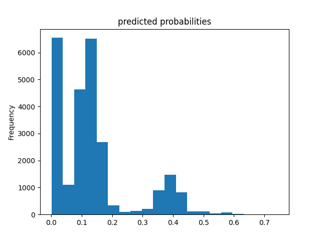

# Project 2: DHS Data Analysis

## Logistic Regression Model
The following code described the logistic regression model.

``` R
lr_res <-
  lr_workflow %>%
  tune_grid(val_set,
            grid = lr_reg_grid,
            control = control_grid(save_pred = TRUE),
            metrics = metric_set(roc_auc))
       
lr_plot <-
  lr_res %>%
  collect_metrics() %>%
  ggplot(aes(x = penalty, y = mean)) +
  geom_point() +
  geom_line() +
  ylab("Area under the ROC Curve") +
  scale_x_log10(labels = scales::label_number())

top_models <-
  lr_res %>%
  show_best("roc_auc", n = 15) %>%
  arrange(penalty)

lr_best <-
  lr_res %>%
  collect_metrics() %>%
  arrange(penalty) %>%
  slice(10)

lr_auc <-
  lr_res %>%
  collect_predictions(parameters = lr_best) %>%
  roc_curve(wealth, .pred_1:.pred_2:.pred_3:.pred_4:.pred_5) %>%
  mutate(model = "Logistic Regression")

```

By the following plot, we noticed that the AUC stayed about the same level until it decreased drastically after the 15th observation. Considering the penalty, we decided that the 10th model gave the best prediction, yielding an average AUC of 0.664.


The Five ROC plots were shown as below:


From this data, we can tell that our model performed beautifully for wealth class 1 and 5, and moderately well for class 4. However, it had some issues distinguishing class 2 and 3. Therefore, a logical follow-up would be to merge class 2 and 3 into one single class and run the logistic regression once again.


## Random Forrest

The following code described the random forrest model.

``` R
rf_mod <-
  rand_forest(mtry = tune(), min_n = tune(), trees = 1000) %>%
  set_engine("ranger", num.threads = cores) %>%
  set_mode("classification")

rf_recipe <-
  recipe(wealth ~ ., data = pns_other)

rf_workflow <-
  workflow() %>%
  add_model(rf_mod) %>%
  add_recipe(rf_recipe)
  
rf_mod %>%
  parameters()

rf_res <-
  rf_workflow %>%
  tune_grid(val_set,
            grid = 25,
            control = control_grid(save_pred = TRUE),
            metrics = metric_set(roc_auc))

rf_res %>%
  show_best(metric = "roc_auc")

rf_best <-
  rf_res %>%
  select_best(metric = "roc_auc")

rf_res %>%
  collect_predictions()

rf_auc <-
  rf_res %>%
  collect_predictions(parameters = rf_best) %>%
  roc_curve(wealth, .pred_1:.pred_2:.pred_3:.pred_4:.pred_5) %>%
  mutate(model = "Random Forest")

bind_rows(rf_auc, lr_auc) %>%
  ggplot(aes(x = 1 - specificity, y = sensitivity, col = model)) +
  geom_path(lwd = 1.5, alpha = 0.8) +
  geom_abline(lty = 3) +
  coord_equal() +
  scale_color_viridis_d(option = "plasma", end = .6)


# second random forest

last_rf_mod <-
  rand_forest(mtry = 4, min_n = 7, trees = 1000) %>%
  set_engine("ranger", num.threads = cores, importance = "impurity") %>%
  set_mode("classification")

last_rf_workflow <-
  rf_workflow %>%
  update_model(last_rf_mod)

last_rf_fit <-
  last_rf_workflow %>%
  last_fit(splits)

last_rf_fit %>%
  collect_metrics()

last_rf_fit %>%
  pluck(".workflow", 1) %>%
  pull_workflow_fit() %>%
  vip(num_features = 20)

last_rf_fit %>%
  collect_predictions() %>%
  roc_curve(wealth, .pred_1:.pred_2:.pred_3:.pred_4:.pred_5) %>%
  
```

The following plot showed the comparison between the random forrest model and the logistic regression model


From the plot, we could observe that the random forrest model had a slightly better performance than the logistic regression model.

The following showed two different random forest models. The first had higher accuracy in predicting class 1 and 4.

 **First**                                                            
    


 **Second**
  


## Linear Estimator 

``` Python
lin_reg = LinearRegression()
pns = pd.read_csv('DHSlbr.csv')

# Subset the wealth class
pns['wealth'] = np.where(pns['wealth'] == k, 1, 0)  # k = 1,2,3,4,5

X_train, X_test = train_test_split(pns, test_size=0.25)
y_train = X_train.pop('wealth')
y_test = X_test.pop('wealth')

size_column = feature_columns[3]
tf.keras.layers.DenseFeatures([size_column])(feature_batch).numpy()

edu_column = feature_columns[2]
tf.keras.layers.DenseFeatures([tf.feature_column.indicator_column(edu_column)])(feature_batch).numpy()

linear_est = tf.estimator.LinearClassifier(feature_columns=feature_columns, n_classes=10)
linear_est.train(train_input_fn)
result = linear_est.evaluate(eval_input_fn)

pred_dicts = list(linear_est.predict(eval_input_fn))
probs = pd.Series([pred['probabilities'][1] for pred in pred_dicts])
probs.plot(kind='hist', bins=20, title='predicted probabilities')

fpr, tpr, _ = roc_curve(y_test, probs)
plt.plot(fpr, tpr)
plt.text(0.6, 0.6, 'AUC = ' + str(result['accuracy']))
plt.title('Linest ROC k')
plt.xlabel('false positive rate')
plt.ylabel('true positive rate')

```

Result: 

Class 1
 


Class 2
 

Class 3
 

Class 4


Class 5
 


Through comparison, we noticed that the accuracy of the linear estimation model increased steadily from class 1 to 5. The ROC at class 1 was around 0.75, whereas at class 5 was around 0.87.


## Boosted Tree 

``` Python
pns = pd.read_csv('DHSlbr.csv')
pns['gender'] = np.where(pns['wealth'] == 1, "male", "female")
pns['wealth'] = np.where(pns['wealth'] == 1, 1, 0)

X_train, X_test = train_test_split(pns, test_size=0.25)
y_train = X_train.pop('wealth')
y_test = X_test.pop('wealth')

n_batches = 1
est = tf.estimator.BoostedTreesClassifier(feature_columns, n_batches_per_layer=n_batches)

# The model will stop training once the specified number of trees is built, not
# based on the number of steps.
est.train(train_input_fn, max_steps=100)

# Eval.
result = est.evaluate(eval_input_fn)
clear_output()
print(pd.Series(result))

# boosted tree
pred_dicts = list(est.predict(eval_input_fn))
probs = pd.Series([pred['probabilities'][1] for pred in pred_dicts])
probs.plot(kind='hist', bins=20, title='predicted probabilities')
plt.show()

```

Result:

Class 1
          


Class 2
          


Class 3
          


Class 4
          


Class 5
          


## Comparison
The best model appeared to be the boosted tree estimation, since it had a perfect prediction for class 1, a very desirable prediction for 4 and 5. Even for 2,3, it still did a decent job.
