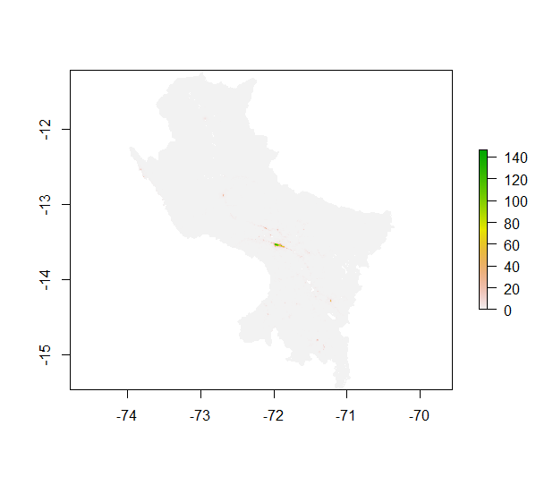

# Project 3: Estimating Population of Cusco

## Overview
In this project, I applied two models, linear regression and random forest, to predict the population of Cusco, a level-1 subdivision of Peru. The original goal was to estimate the population for the whole country. However, given the large size of Peru and restictions of R's processing power of rasters, the final object became just the Cusco province.


## Methodology
First, import the boundary data (level-1 and level-3) and create the lulc and lulc_adm3 object. 

```R
per_adm1  <- read_sf("gadm36_PER_1.shp")
per_adm3  <- read_sf("gadm36_PER_3.shp")

per_adm1 <- ms_simplify(per_adm1)
per_adm3 <- ms_simplify(per_adm3)

per_adm1 <- st_as_sf(per_adm1)
per_adm3 <- st_as_sf(per_adm3)

per3_cusco <- per_adm3 %>%
  filter(NAME_1 == "Cusco")

per1_cusco <- per_adm1 %>%
  filter(NAME_1 == "Cusco")

water <- raster("per_esaccilc_dst_water_100m_2000_2012.tif")
dst011 <- raster("per_esaccilc_dst011_100m_2015.tif")
dst040 <- raster("per_esaccilc_dst040_100m_2015.tif")
dst130 <- raster("per_esaccilc_dst130_100m_2015.tif")
dst140 <- raster("per_esaccilc_dst140_100m_2015.tif")
dst150 <- raster("per_esaccilc_dst150_100m_2015.tif")
dst160 <- raster("per_esaccilc_dst160_100m_2015.tif")
dst190 <- raster("per_esaccilc_dst190_100m_2015.tif")
dst200 <- raster("per_esaccilc_dst200_100m_2015.tif")
pop20 <- raster("per_ppp_2020.tif")
slope <- raster("per_srtm_slope_100m.tif")
topo <- raster("per_srtm_topo_100m.tif")
viirs <- raster("per_viirs_100m_2015.tif")

lulc <- stack(water, dst011, dst040, dst130, dst140, dst150, dst160, dst190, dst200, pop20, slope, topo, viirs)
names(lulc) <- c("water", "dst011", "dst040", "dst130", "dst140","dst150", "dst160","dst190", "dst200", "pop20", "slope", "topo", "ntl")
 
lulc <- crop(lulc, per1_cusco)
lulc <- mask(lulc, per1_cusco)
lulc[is.na(lulc)] <- 0 #this fixes NA
lulc <- crop(lulc, per1_cusco)
lulc <- mask(lulc, per1_cusco)

lulc_adm3 <- exact_extract(lulc, per3_cusco, fun=c('sum', 'mean'))

```

Next, split the data and run the linear regression model

```R

data <- lulc_adm3[ , 1:13]

data_split <- initial_split(data, prop = 4/5)
data_train <- training(data_split)
data_test <- testing(data_split)

data_recipe <- 
  recipe(sum.pop20 ~ ., data = data_train)

preprocess <- prep(data_recipe)

lr_model <- 
  linear_reg()%>%
  set_engine("lm") %>%
  set_mode("regression")

lr_workflow <- workflow() %>%
  add_recipe(data_recipe) %>%
  add_model(lr_model)

final_model <- fit(lr_workflow, data)

rstr_to_df <- as.data.frame(lulc, xy = TRUE)
names(rstr_to_df) <- c("x", "y", "sum.water", "sum.dst011", "sum.dst040", "sum.dst130", "sum.dst140", 
                 "sum.dst150", "sum.dst160", "sum.dst190", "sum.dst200", "sum.pop19", "sum.slope", "sum.topo",
                 "sum.ntl")

preds <- predict(final_model, new_data = rstr_to_df)
coords_preds <- cbind.data.frame(rstr_to_df[ ,1:2], preds)
predicted_values_sums <- rasterFromXYZ(coords_preds)
ttls <- exact_extract(predicted_values_sums, per3_cusco, fun=c('sum'))

per3_cusco <- per3_cusco %>%
  add_column(preds_sums = ttls)

predicted_totals_sums <- rasterize(per3_cusco, predicted_values_sums, field = "preds_sums")
gridcell_proportions_sums  <- predicted_values_sums / predicted_totals_sums

cellStats(gridcell_proportions_sums, sum)

per_pop20 <- raster("per_ppp_2020.tif")
cusco_adm3_pop20 <- exact_extract(per_pop20, per3_cusco, fun=c('sum'))
per3_cusco <- per3_cusco %>%
  add_column(pop20 = cusco_adm3_pop20)

population_adm3 <- rasterize(per3_cusco, predicted_values_sums, field = "pop20")
population_sums <- gridcell_proportions_sums * population_adm3

cellStats(population_sums, sum)
sum(per3_cusco$pop20)

cusco_pop20 <- crop(per_pop20, per3_cusco)
cusco_pop20 <- mask(cusco_pop20, per3_cusco)
diff_sums <- population_sums - cusco_pop20

plot(cusco_pop20)
plot(population_sums)
plot(diff_sums)
rasterVis::plot3D(diff_sums)
cusco_rmse <- rmse(cusco_pop20, population_sums)

```

Finally, run the random forest model.

```R

model <- randomForest(sum.pop20 ~ ., data = data)

plot(model)
varImpPlot(model)

names(lulc) <- c("sum.water", "sum.dst011", "sum.dst040", "sum.dst130", "sum.dst140", 
                 "sum.dst150", "sum.dst160", "sum.dst190", "sum.dst200", "sum.pop20", 
                 "sum.slope", "sum.topo", "sum.ntl")

predicted_values_sums <- raster::predict(lulc, model, type="response", progress="window")
ttls <- exact_extract(predicted_values_sums, per_adm3, fun=c('sum'))

per_adm3 <- per_adm3 %>%
  add_column(rf_preds_sums = ttls)

predicted_totals_sums <- rasterize(per_adm3, predicted_values_sums, field = "rf_preds_sums")
gridcell_proportions_sums  <- predicted_values_sums / predicted_totals_sums

cellStats(gridcell_proportions_sums, sum)

population_adm3 <- rasterize(per3_cusco, predicted_values_sums, field = "pop20")
population_sums <- gridcell_proportions_sums * population_adm3

cellStats(population_sums, sum)
sum(per3_cusco$pop20)

diff_sums <- population_sums - per_pop20

plot(population_sums)
plot(diff_sums)
rasterVis::plot3D(diff_sums)
cellStats(abs(diff_sums), sum)

```


## Numerical Result
**Actual population of Cusco: 1408049**

**Predicted population of linear regression: 1408218**

**Predicted population of random forest: 1408220**

Surprisingly, the result from the linear regression model and the random forest model was almost identical. 


## Graphical Result
**Raster plot for the actual total population in Cusco**



**Raster plots for the predicted total population **

Linear Regression    

     

Random Forrest


**Raster plots for the predicted population difference**

Linear Regression    

     

Random Forrest


**3D plots for the predicted total population**

Linear Regression    

     

Random Forrest


From the plot result, we can see that the prediction from linear regression and random forest was almost the same.


**Other results**

Linear regression RMSE plot


Random Forest model


## Analysis

To be further decided. 
