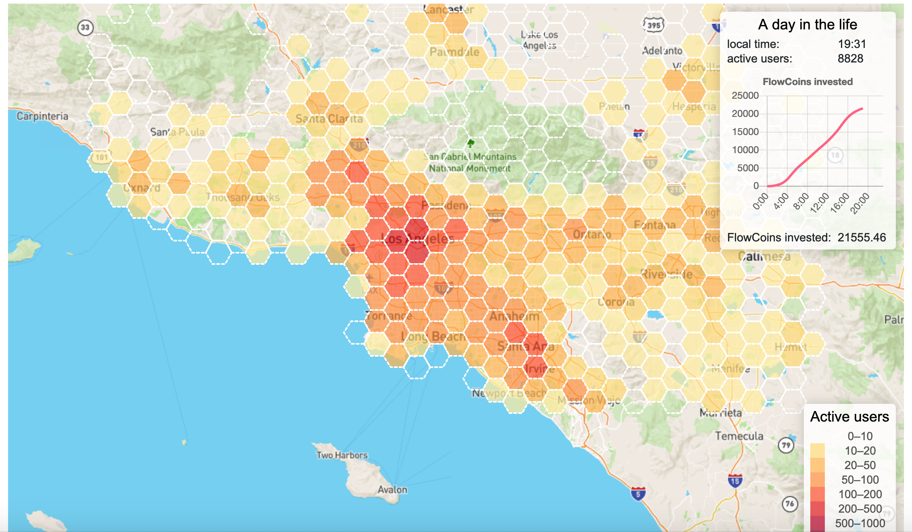
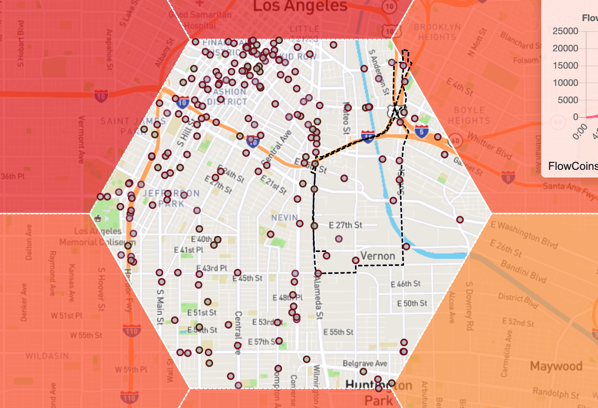

# Project 4: Final Project Proposal--Location Prediction of Individuals in LA Based on Cellphone Data

## Problem statement

In this project, I will explore the potential of location data. The goal make two predictions based on the location data of individuals in Los Angeles. First, given the location data of an individual over a certain amount of time, we want to predict the potential location of that individual at a particular time. For example, if we know the John's location from Jan 2021 to Apr 2021, we want to predict his location at 2-4pm on June 1st, 2021. Second, we want to predict the number of people in a certain area at a particular time. For example, how many people are in Chinatown area between 9-11am on a particular  Saturday. These results will have great implications in tracking the activities of certain individuals, or assessing the level of crowdness in a certain area. Both are meaningful in municipal regulations.

## Data and Approach

The data are collected by a mobile app [moveFlow](https://moveflow.tech/) where people provide their locations in exchange for a certain amount of payback. From the website, we view the real time location of all the users as well as the number of people in a certain area in Los Angeles. 

    

    

The detailed data come from a [dataset provided by matsim](https://github.com/matsim-scenarios/matsim-los-angeles). Each record contains three parts: longtitude, latitude and time stamp. To analyze the data, We use basic convolutional neural networks and tools provided by matsim. Since the majority of the matsim codes are written in Java, we will employ IntelliJ as our primary IDE for running the model. 
